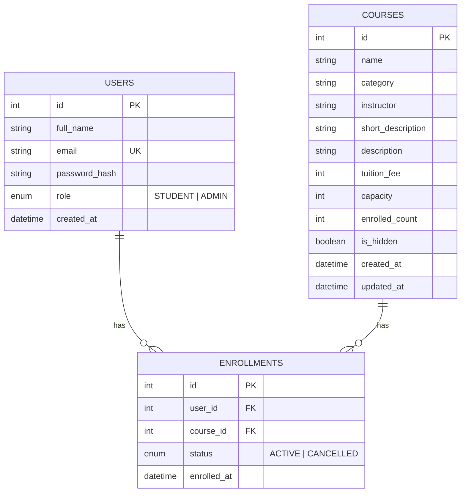

# ERD

```mermaid
erDiagram
    USERS ||--o{ ENROLLMENTS : "has"
    COURSES ||--o{ ENROLLMENTS : "has"

    USERS {
        int id PK
        string full_name
        string email UK
        string password_hash
        enum role "STUDENT | ADMIN"
        datetime created_at
    }
    COURSES {
        int id PK
        string name
        string category
        string instructor
        string short_description
        string description
        int tuition_fee
        int capacity
        int enrolled_count
        boolean is_hidden
        datetime created_at
        datetime updated_at
    }
    ENROLLMENTS {
        int id PK
        int user_id FK
        int course_id FK
        enum status "ACTIVE | CANCELLED"
        datetime enrolled_at
    }
```

Ràng buộc: `UNIQUE (user_id, course_id)`, `CHECK (enrolled_count <= capacity)`.